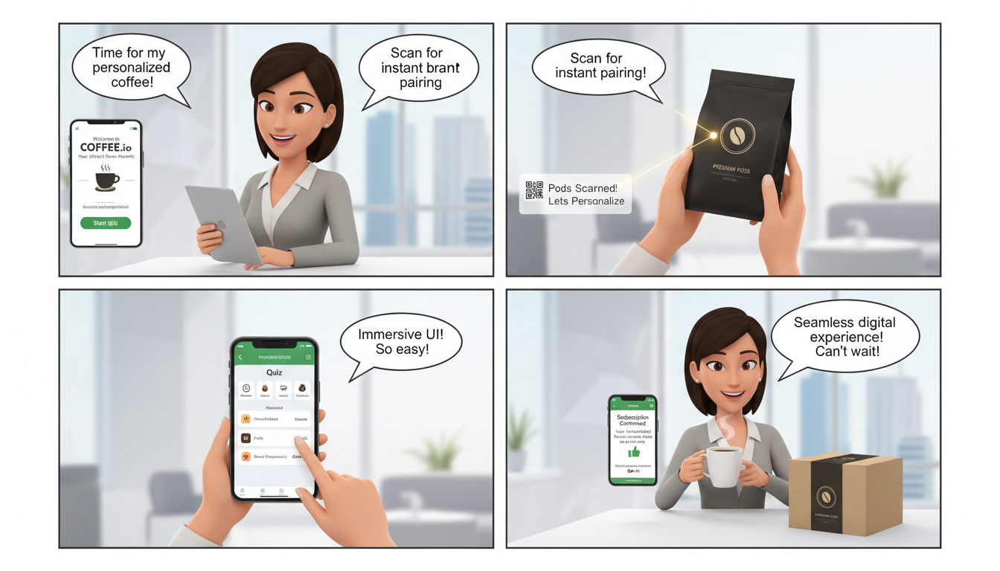

# ☕ Origen Coffee Roasters - Coffee Pods Platform

[](https://reactjs.org/)
[](https://vitejs.dev/)
[](https://tailwindcss.com/)
[](https://firebase.google.com/)
[](https://greensock.com/gsap/)

**Origen Coffee Roasters** is a high-performance, immersive e-commerce platform dedicated to specialty coffee and pods. Built with a focus on high-end UI/UX, the project combines a token-driven design system with advanced animations to provide a premium shopping experience.

---

## 🚀 Key Features

-   **✨ Immersive UI/UX:** High-fidelity animations using GSAP and Framer Motion, including ScrollTrigger effects and fluid transitions.
-   **📦 Subscription Flow:** A custom interactive quiz/modal flow for coffee subscriptions tailored to user preferences.
-   **🎨 Token-Driven Design:** Centralized design system using Tailwind CSS v4 and HeroUI, utilizing CSS variables for dynamic theming.
-   **🛒 Advanced Cart System:** Real-time state management with **Zustand**, featuring bundle logic, interactive drawers, and persistent storage.
-   **📱 Mobile-First Architecture:** Responsive design optimized for all devices with specific focus on touch interactions.
-   **🔍 QR Product Visor:** Specialized dynamic routes (`/qr/:route`) for physical product interaction, bridging the gap between offline and online.
-   **🔥 Firebase Backend:** Fully integrated with Firebase Authentication, Firestore (Real-time DB), and Hosting.
-   **🤖 Agentic Development:** Includes specialized AI skill-sets (`.agents/skills`) for GSAP, UI/UX, and HeroUI to maintain code consistency and design excellence.

---

## 🛠️ Tech Stack

### Frontend
- **Framework:** React 19 (using the latest concurrent features)
- **Styling:** Tailwind CSS v4, HeroUI, Radix UI (Headless components)
- **Animations:** GSAP (ScrollTrigger, Timeline), Framer Motion, Three.js
- **State Management:** Zustand
- **Routing:** React Router v7
- **Forms:** React Hook Form + Zod validation

### Backend & Infrastructure
- **BaaS:** Firebase (Auth, Firestore, Hosting)
- **Environment:** Vite 6
- **Scripting:** TSX for data backfilling and migration scripts

---

## 📂 Project Structure

```text
├── .agents/                 # Custom AI Agent skills and instructions
├── .github/                 # Copilot instructions and UI/UX skill docs
├── assets/                  # High-quality videos, images, and webmanifests
├── src/
│   ├── components/
│   │   ├── auth/            # Firebase Auth modals and logic
│   │   ├── cart/            # Zustand-powered cart components
│   │   ├── glopet/          # Specialized UI components (Hero, CTA, etc.)
│   │   └── layout/          # Global wrappers and Nav
│   ├── pages/               # Route-level views (Shop, Profile, QR Visor)
│   ├── scripts/             # Pinecone/Firestore migration scripts
│   ├── seo/                 # SEO & Metadata management
│   └── store/               # Zustand state stores
├── firebase.json            # Firebase configuration
└── tailwind.config.js       # Custom design tokens
```

---

## 🚦 Getting Started

### Prerequisites
- Node.js 20+
- npm or pnpm
- A Firebase project setup

### Installation

1. **Clone the repository:**
   ```bash
   git clone https://github.com/your-org/coffee-pods-bros.git
   cd coffee-pods-bros
   ```

2. **Install dependencies:**
   ```bash
   npm install
   ```

3. **Environment Setup:**
   Create a `.env` file in the root and add your Firebase configuration:
   ```env
   VITE_FIREBASE_API_KEY=your_key
   VITE_FIREBASE_AUTH_DOMAIN=your_domain
   VITE_FIREBASE_PROJECT_ID=your_id
   ```

4. **Run Development Server:**
   ```bash
   npm run dev
   ```

---

## 💡 Usage Examples

### Using the Animation System (GSAP)
The project uses a sophisticated animation system defined in `.agents/skills/gsap-core`.

```tsx
import { useEffect, useRef } from 'react';
import gsap from 'gsap';
import { ScrollTrigger } from 'gsap/ScrollTrigger';

gsap.registerPlugin(ScrollTrigger);

export const HeroSection = () => {
  const boxRef = useRef(null);

  useEffect(() => {
    gsap.to(boxRef.current, {
      scrollTrigger: {
        trigger: boxRef.current,
        start: "top center",
        scrub: true
      },
      scale: 1.5,
      duration: 2
    });
  }, []);

  return <div ref={boxRef}>Specialty Coffee</div>;
};
```

### Implementing the Cart Store (Zustand)
```typescript
import { create } from 'zustand';

interface CartStore {
  items: any[];
  addItem: (item: any) => void;
}

export const useCartStore = create<CartStore>((set) => ({
  items: [],
  addItem: (item) => set((state) => ({ items: [...state.items, item] })),
}));
```

---

## 🤖 AI Skill-Sets
One of the unique aspects of this repo is the inclusion of `.agents/skills`. These markdown files provide context-aware instructions for AI agents (like GitHub Copilot or Cursor) to:
- Follow strict **HeroUI** implementation patterns.
- Adhere to **GSAP performance** best practices.
- Maintain **UI/UX Pro Max** design standards (tokens, spacing, micro-interactions).

---

## 📜 Scripts
- `npm run dev`: Starts the Vite development server.
- `npm run build`: Optimizes the project for production.
- `npm run migrate:pinecone`: Handles vector database migrations for search.
- `npm run backfill:formats`: Populates Firestore with product format metadata.

---

## 📄 License
© 2024 Origen Coffee Roasters. All rights reserved. Built with ❤️ for the specialty coffee community.